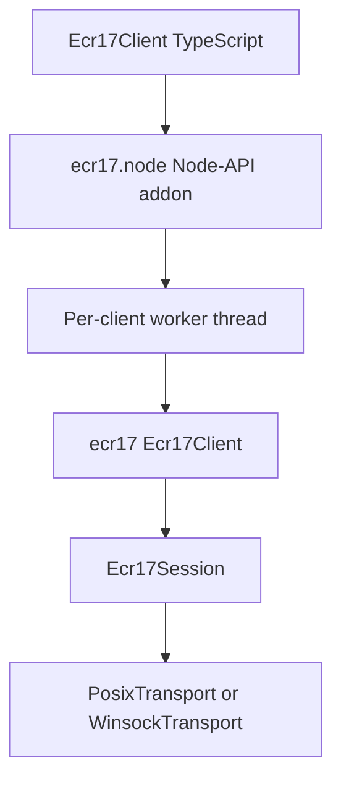

# Node.js

`@padosoft/ecr17-node` is the **Node.js API**: a TypeScript client over a Node-API addon, built on the C++ protocol core (`@padosoft/ecr17`). It has the same API as `@padosoft/react-native-ecr17` (the same `createEcr17Client`, methods, requests, results and events) and runs the same C++ client, so the auto-connect, the pre-send liveness probe and the money-safe retry policy are the same code.

Use it for POS back-ends, kiosks, command-line tools and tests on macOS, Linux and Windows.

## Requirements

- Node.js 20 or newer.
- A prebuilt addon for the platform: `linux-x64`, `linux-arm64` (glibc 2.35+), `darwin-arm64` or `win32-x64`. On any other platform, build it from source (see below).
- A Nexi Group ECR17-compatible terminal configured for LAN integration.

## Install

```bash
npm install @padosoft/ecr17-node
```

::: callout warning "Not on npm yet"
`@padosoft/ecr17-node`, the core `@padosoft/ecr17` and the build helpers the core depends on (`@padosoft/native-modules`) are not published on npm yet.
:::

## Usage

```ts
import { createEcr17Client } from "@padosoft/ecr17-node";

const client = createEcr17Client({
  host: "192.168.1.50",
  port: 10000,
  terminalId: "12345678",
  cashRegisterId: "00000001",
  autoReconnect: true,
});

client.setOnProgress(({ message }) => console.log(message));
client.setOnConnectionStateChange((state) => console.log(state));

const result = await client.pay({ amountCents: 650 });
if (result.outcome === "ok") {
  console.log("approved", result.authCode);
}

client.close();
```

Code written for React Native runs unchanged. Two additions:

- `close()` closes the socket and releases the native client. It is also called by `using client = createEcr17Client(…)` (`Symbol.dispose`).
- `new Ecr17Client(config)` works as well as `createEcr17Client(config)`.

## How it works



- Every command blocks while the terminal works (a payment waits for the cardholder), so each client owns a native worker thread that runs its commands in order. Nothing blocks the event loop or libuv's thread pool.
- Results and events (`setOnProgress`, `setOnReceiptLine`, `setOnConnectionStateChange`) come back on the event loop through one ordered queue per client: a command's events always arrive before its promise settles.
- An idle client does not keep the process alive; a pending command does, until it settles. A closed client emits no more events.
- A listener that throws surfaces as an `uncaughtException`, like an `EventEmitter` listener's error.
- The TCP transport is `PosixTransport` on macOS and Linux and `WinsockTransport` on Windows. Both use a write-free pre-send probe (`poll` / `select` plus `recv(MSG_PEEK)`), signal a drop once, and never raise `SIGPIPE`.

## Errors

- Invalid input (a non-finite amount, an unknown `paymentType`) rejects with a `TypeError` before anything is sent.
- Command failures (connection, timeout, NAK exhaustion, a dropped connection) reject with an `Error` whose `code` is `ECR17_COMMAND_FAILED`.

::: callout danger "Money safety"
With `autoReconnect`, a command interrupted by a drop is re-sent only if it is read-only (`status`, `totals`, `sendLastResult`, `enableEcrPrinting`). A financial command is never re-sent: the terminal may already have charged the card. Recover its outcome with `sendLastResult()`. The same applies to `close()` while a command is on the wire.
:::

## Build from source

On a platform without a prebuild, build the addon in the package folder. It needs CMake 3.21+ and a C++20 compiler; the core's C++ sources come from the `@padosoft/ecr17` dependency:

```bash
cd node_modules/@padosoft/ecr17-node
npx cmake-js compile --directory node --out build
```

The addon is looked up in `build/Release/ecr17.node`, then `prebuilds/<platform>-<arch>/ecr17.node`. Set `ECR17_NODE_ADDON` to the path of an `ecr17.node` to override both.

## Tests

The Node tests drive the whole stack (TypeScript → addon → core → TCP) against a scripted fake terminal. They include a payment interrupted by a drop, which must go out exactly once. CI (`Node.js addon`) runs them on Linux, macOS and Windows and uploads each addon for the release.

```bash
cd packages/ecr17-node
bun run build:node
bun run test:node
```
