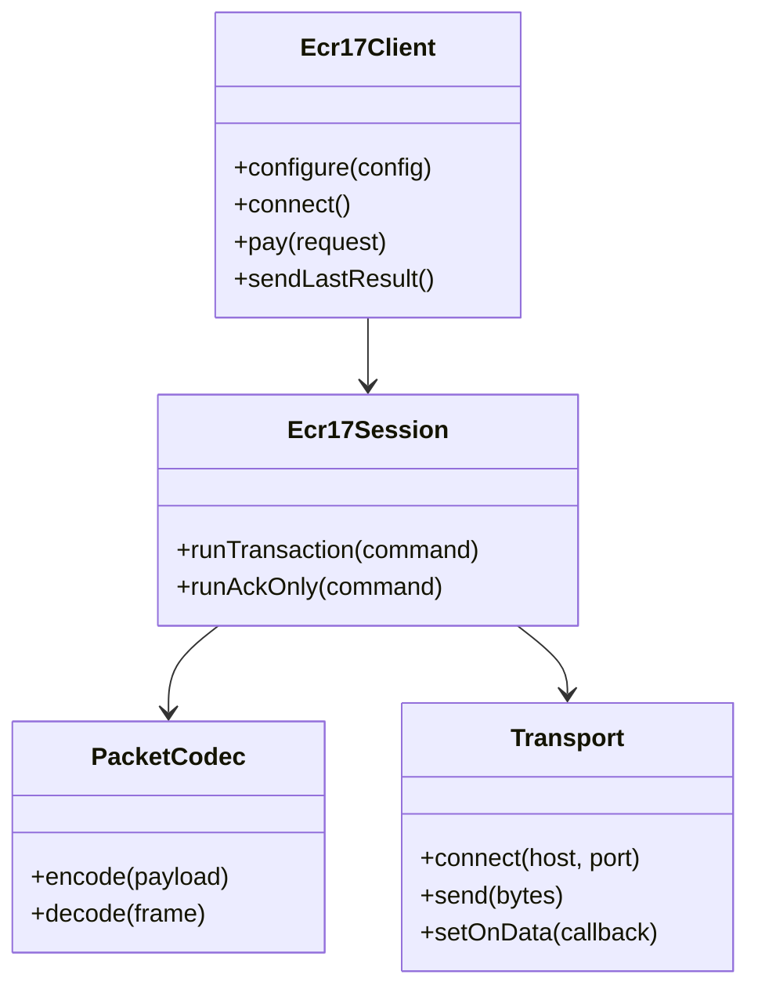

# Design

The design separates byte transport from protocol semantics.

## Design principles

- Validate local request fields before transport send.
- Decode defensively and never read past malformed payloads.
- Keep ACK/NAK retransmission inside the session boundary.
- Make business-level recovery explicit through `sendLastResult()`.
- Emit terminal progress without making UI code parse protocol bytes.

::: collapsible "Design tradeoff: one transaction at a time" open
ECR17 is a synchronous request-response protocol. The client serializes commands because parallel transactions on one terminal would create ambiguous terminal state and unsafe recovery behavior.
:::
