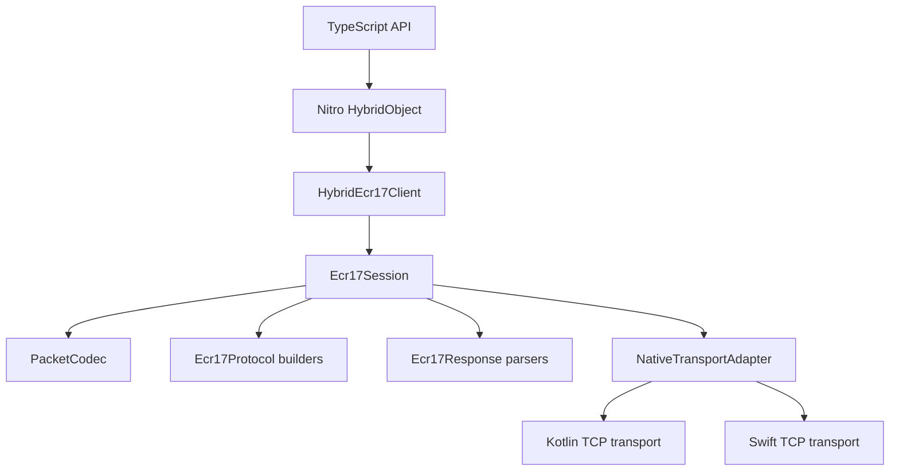

# Architecture Overview

The library keeps protocol behavior in shared C++ and uses platform-native networking only for TCP I/O.

## Layers

- `package/src`: TypeScript exports, specs, helper factory, and public types.
- `package/cpp/Lcr`: LRC calculation and mode handling.
- `package/cpp/PacketCodec`: ECR17 framing and decode rules.
- `package/cpp/Ecr17Protocol`: request builders.
- `package/cpp/Ecr17Response`: response parsers.
- `package/cpp/Session`: ACK/NAK, progress, receipts, retransmit, and timeout orchestration.
- `package/cpp/Ecr17Client`: Nitro C++ HybridObject implementation.
- `package/android` and `package/ios`: platform TCP transports.

::: callout info "Why C++"
C++ gives one tested protocol engine for both platforms. Kotlin and Swift stay focused on socket lifecycle and byte delivery.
:::
