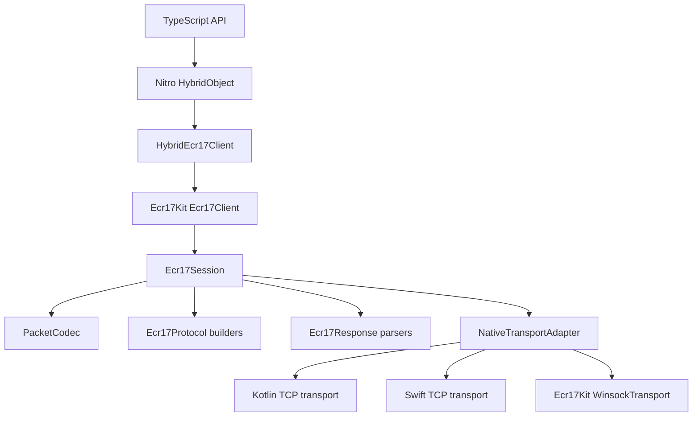

# Architecture Overview

The library keeps protocol behavior in shared C++ and uses platform-native networking only for TCP I/O. The C++ lives in two packages: **`@padosoft/ecr17-kit`** (`packages/ecr17-kit/`), the React-free protocol library that native apps can use too, and **`@padosoft/react-native-ecr17`** (`packages/react-native-ecr17/`), the Nitro binding.

```mermaid
flowchart TB
  JS[TypeScript API] --> Nitro[Nitro HybridObject]
  Nitro --> Hybrid[HybridEcr17Client]
  Hybrid --> Client[Ecr17Kit Ecr17Client]
  Client --> Session[Ecr17Session]
  Session --> Codec[PacketCodec]
  Session --> Protocol[Ecr17Protocol builders]
  Session --> Response[Ecr17Response parsers]
  Session --> Adapter[NativeTransportAdapter]
  Adapter --> Android[Kotlin TCP transport]
  Adapter --> IOS[Swift TCP transport]
  Adapter --> Windows[Ecr17Kit WinsockTransport]
```

## Layers

- `packages/react-native-ecr17/src`: TypeScript exports, specs, helper factory, and public types.
- `packages/ecr17-kit/cpp` (`Ecr17Kit/…` headers):
  - `Lcr`: LRC calculation and mode handling.
  - `PacketCodec`: ECR17 framing and decode rules.
  - `Ecr17Protocol`: request builders.
  - `Ecr17Response`: response parsers.
  - `Ecr17Session`: ACK/NAK, progress, receipts, retransmit, and timeout orchestration.
  - `Ecr17Client`: auto-connect, the pre-send liveness probe, and the money-safe retry policy.
- `packages/ecr17-kit/windows`: the Winsock transport.
- `packages/react-native-ecr17/cpp/Ecr17Client`: the Nitro HybridObject, mapping the JS types onto the Kit's `Ecr17Client`.
- `packages/react-native-ecr17/android` and `packages/react-native-ecr17/ios`: the Kotlin and Swift TCP transports.

::: callout info "Why C++"
C++ gives one tested protocol engine for every platform, and a library that fully native apps can use without React Native. Kotlin and Swift stay focused on socket lifecycle and byte delivery.
:::
