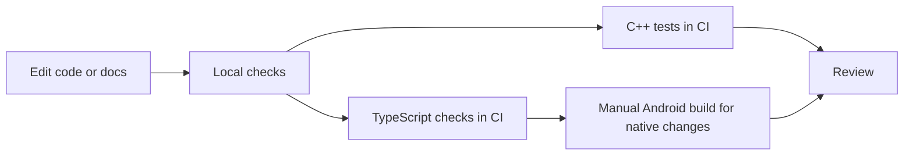

# Pipeline

The repository uses local checks and GitHub Actions to cover the protocol core and TypeScript/Nitro surface.

## Documentation pipeline

::: steps
1. Edit Markdown under `docs-site/docs`.
2. Keep every page in `docs-site/docmd.config.json` navigation.
3. Run `npm run check` from the repository root.
4. Run `npm run build` from the repository root.
5. Confirm `_site`, `llms.txt`, `sitemap.xml`, and semantic search artifacts exist under `docs-site/_site`.
:::

## Code pipeline

- C++ protocol tests run in CI.
- TypeScript and Nitro codegen checks run in CI.
- Android build is manual-dispatch for native integration changes.

::: callout warning "Native behavior needs native verification"
JNI class-loader issues, socket liveness races, and terminal half-closes are not fully represented by unit tests. Verify native changes with a real app build and, when possible, a real terminal.
:::
