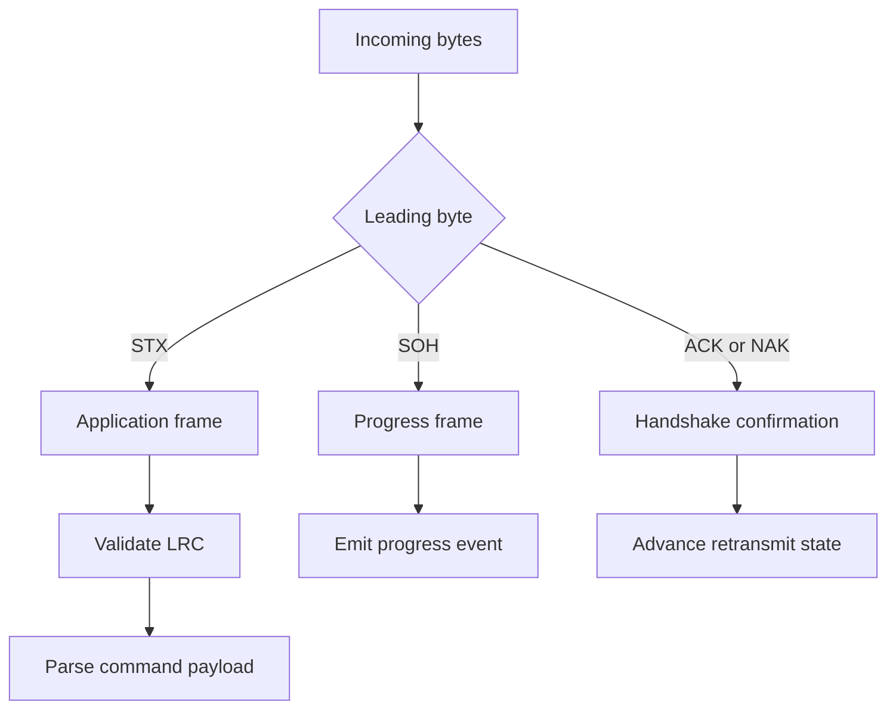

# Protocol Frames

The C++ `PacketCodec` treats each decoded buffer as exactly one frame. Stream splitting belongs to the transport/session boundary.



## Application frame

```text
STX payload ETX LRC
```

## Progress frame

```text
SOH 20-char-message EOT
```

## ACK and NAK

The terminal can acknowledge a frame or request retransmission. The session retransmits according to the configured retry count and the command safety policy.

::: callout danger "Retransmit is not business retry"
ACK/NAK retransmission happens inside one physical exchange. It is different from replaying a payment after a disconnected transaction.
:::
