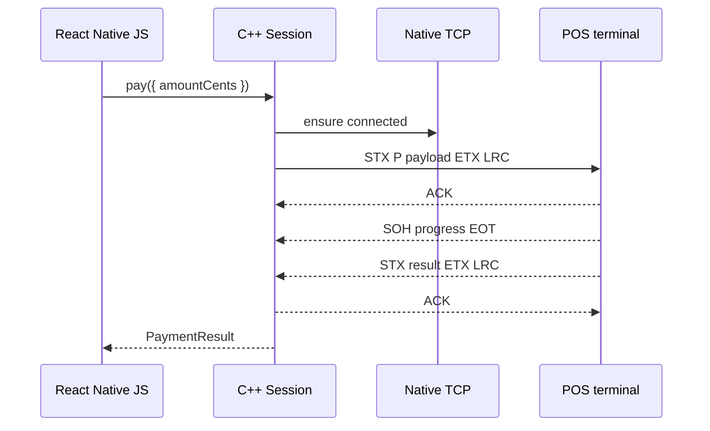

# Payment Flow

A payment is a full request-response exchange: connect, send command `P` or `X`, wait for terminal ACK, stream progress, parse the final result, then optionally drain receipt lines.



## Recommended structure

::: steps
1. Call `status()` during pairing or startup.
2. Display terminal state to the operator.
3. Call `pay()` only from an explicit checkout action.
4. Show progress events as transient payment status.
5. Persist `resultCode`, `stan`, `onlineId`, and `authCode` with the sale.
6. If the connection drops during a financial command, reconnect and call `sendLastResult()`.
:::

::: callout danger "Financial commands are not idempotent"
`pay`, `payExtended`, `reverse`, `preAuth`, `incrementalAuth`, and `preAuthClosure` can affect money movement. Automatic replay can duplicate effects.
:::

## Minimal payment handler

```ts
async function collectPayment(amountCents: number) {
  try {
    const result = await client.pay({ amountCents });
    return result;
  } catch (error) {
    await client.connect();
    return client.sendLastResult();
  }
}
```

The catch block recovers the last terminal result. It does not reissue `pay()`.
