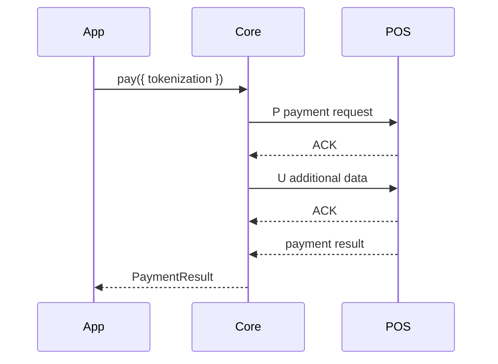

# Tokenization

Tokenization is requested with command `U` as additional data attached to a payment, pre-authorization, or card verification flow.

```ts
await client.pay({
  amountCents: 1000,
  tokenization: {
    service: "recurring",
    contractCode: "1666354841608"
  }
});
```

## Supported service values

- `recurring`: merchant-initiated recurring agreement.
- `unscheduledOrOneClick`: unscheduled credential-on-file or one-click use.

::: callout warning "Acquirer rules still apply"
The protocol can carry tokenization data, but the merchant contract, terminal estate, and acquirer configuration decide whether tokenization is accepted.
:::

## Flow


