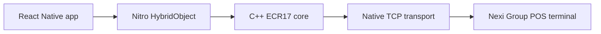

# react-native-ecr17-protocol

`react-native-ecr17-protocol` is the padosoft documentation site for a React Native Nitro module that drives Nexi Group ECR17-compatible POS terminals over LAN from iOS and Android apps.

::: callout warning "Money-critical integration"
The terminal can charge real cards. Treat payment, reversal, pre-authorization, and closure commands as non-idempotent operations. On a disconnect, recover the terminal outcome with `sendLastResult()` instead of blindly replaying a financial command.
:::

::: grids
::: grid
::: card "Start"
Install the module, configure a terminal endpoint, and run your first status or payment call.

Read [Quickstart](/quickstart).
:::
:::

::: grid
::: card "Understand"
Learn how ECR17 frames, LRC, ACK/NAK, progress frames, and receipts fit together.

Read [Teoria](/concepts/teoria).
:::
:::

::: grid
::: card "Operate"
Use the runbook to diagnose LAN, timeout, LRC, and terminal-state failures.

Read [Runbook](/operations/runbook).
:::
:::
:::

## What it includes

- Shared C++20 protocol core for framing, LRC, builders, parsers, session orchestration, and retry policy.
- Nitro HybridObject API exposed to React Native JavaScript.
- Native TCP transport implemented in Kotlin on Android and Swift on iOS.
- Event streams for progress messages, receipt lines, and connection state.
- Tests for packet handling, command builders, response parsing, safety policy, and end-to-end session flows.

## Command surface

The public client supports `status`, `pay`, `payExtended`, `reverse`, `preAuth`, `incrementalAuth`, `preAuthClosure`, `verifyCard`, `closeSession`, `totals`, `sendLastResult`, `enableEcrPrinting`, `reprint`, and `vas`.

## Project metadata

- Package examples import from `react-native-ecr17`.
- GitHub repository: `padosoft/react-native-ecr17-protocol`.
- Organization and author: `padosoft`.
- License: MIT.
- Project banner asset: `resources/banner.png` in the repository.
- Brand color: `#0d9488`.
